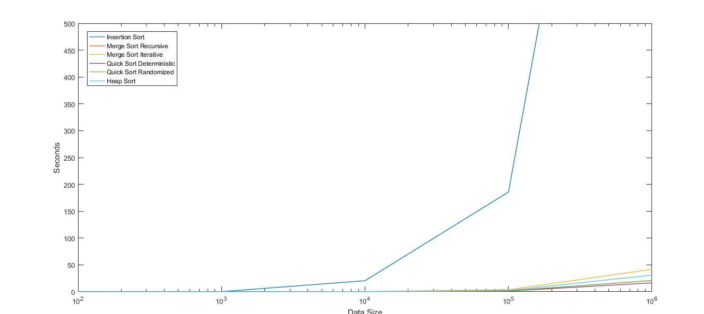

# sorting-algorithms-implementation-and-comparison
Implementation of sorting algorithms in python

- Insertion Sort
- Merge Sort(Recursive)
- Merge Sort(Iterative)
- Quick Sort(Deterministic)
- Quick Sort(Iterative)
- Heap Sort

## Comparisons
Datasets of multiple sample sizes with random numbers are first generated. Each algorithm is run on these sets and the time taken is used to compare the performances   
### Time Elasped

Sorting Algorithm / Sample Size  | 10 | 100 | 1000 | 10000 | 100000 | Average Performance
------------- | ------------- | ------------- | ------------- | ------------- | ------------- | -------------
Insertion Sort  | 0.0 | 0.20 | 20.47 | 185.74 | Undefined | Undefined
Merge Sort Recursive  | 0.0 | 0.0 | 0.13 | 1.75 | 21.019 | 4.58
Merge Sort Iterative | 0.01| 0.03 | 0.35 | 3.75 | 41.77 | 9.18
Quick Sort Deterministic | 0.0 | 0.01 | 0.10 | 1.26 | 16.52 | 3.58
Quick Sort Randomized  | 0.0 | 0.0 | 0.11 | 1.52 | 20.75 | 4.47
Heap Sort  | 0.0 | 0.01 | 0.18 | 2.41 | 30.86 | 6.69

Time taken is represented in seconds

